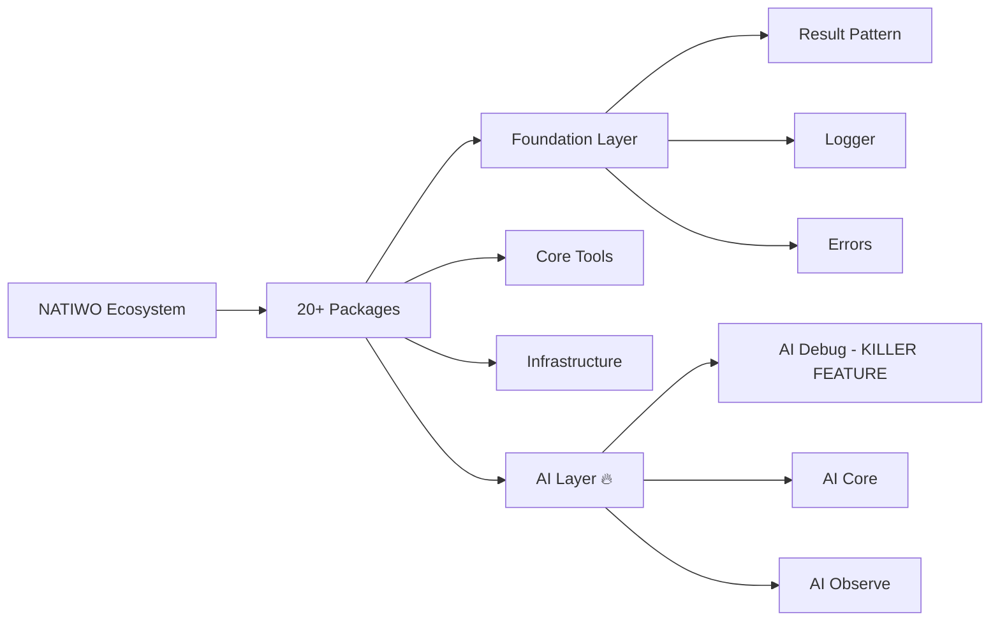

  

  ### Building the Future with AI-Native Technology

   

  
  
  
  
  

  **Enterprise-grade technology ecosystem democratizing access to world-class solutions**

  [🌐 Website](https://natiwo.com.br) • [📦 Packages](https://github.com/orgs/Natiwo/repositories) • [📚 Documentation](#documentation) • [🤝 Contact](#contact)

---

## 🚀 The NATIWO Ecosystem

We're building the most comprehensive **AI-native development ecosystem** for modern applications. Our philosophy is simple:

> **"Why replace when you can enhance?"**

### 📊 Ecosystem Overview

### 🎯 Our Packages

<table>
  <tr>
    <th>Layer</th>
    <th>Packages</th>
    <th>Status</th>
    <th>Coverage</th>
  </tr>
  <tr>
    <td><b>🏗 Foundation</b></td>
    <td>
      <a href="https://github.com/Natiwo/natiwo-result">@natiwo/result</a> 
      <a href="https://github.com/Natiwo/natiwo-logger">@natiwo/logger</a> 
      <a href="https://github.com/Natiwo/natiwo-errors">@natiwo/errors</a> 
      <a href="https://github.com/Natiwo/natiwo-types">@natiwo/types</a>
    </td>
    <td>
      ✅ Released 
      ✅ Released 
      ✅ Released 
      🚧 In Progress
    </td>
    <td>
      82.71% 
      88.94% 
      92.71% 
      -
    </td>
  </tr>
  <tr>
    <td><b>🛠 Core Tools</b></td>
    <td>
      <a href="https://github.com/Natiwo/natiwo-decorators">@natiwo/decorators</a> 
      <a href="https://github.com/Natiwo/natiwo-validator">@natiwo/validator</a> 
      <a href="https://github.com/Natiwo/natiwo-events">@natiwo/events</a> 
      <a href="https://github.com/Natiwo/natiwo-di">@natiwo/di</a>
    </td>
    <td>
      🚧 In Progress 
      🚧 In Progress 
      🚧 In Progress 
      🚧 In Progress
    </td>
    <td>
      - 
      - 
      - 
      -
    </td>
  </tr>
  <tr>
    <td><b>🏢 Infrastructure</b></td>
    <td>
      <a href="https://github.com/Natiwo/natiwo-orm">@natiwo/orm</a> 
      <a href="https://github.com/Natiwo/natiwo-auth">@natiwo/auth</a> 
      <a href="https://github.com/Natiwo/natiwo-cache">@natiwo/cache</a> 
      <a href="https://github.com/Natiwo/natiwo-queue">@natiwo/queue</a>
    </td>
    <td>
      📝 Planned 
      📝 Planned 
      📝 Planned 
      📝 Planned
    </td>
    <td>
      - 
      - 
      - 
      -
    </td>
  </tr>
  <tr>
    <td><b>🤖 AI Layer</b></td>
    <td>
      <a href="https://github.com/Natiwo/natiwo-ai-debug">@natiwo/ai-debug</a> 🔥 
      <a href="https://github.com/Natiwo/natiwo-ai-core">@natiwo/ai-core</a> 
      <a href="https://github.com/Natiwo/natiwo-ai-observe">@natiwo/ai-observe</a> 
      <a href="https://github.com/Natiwo/natiwo-ai-assist">@natiwo/ai-assist</a>
    </td>
    <td>
      🔥 Priority 
      📝 Planned 
      📝 Planned 
      📝 Planned
    </td>
    <td>
      - 
      - 
      - 
      -
    </td>
  </tr>
</table>

---

## 🎯 Who We Are

**NATIWO** is a Brazilian technology company with **6 years of history**, focused on democratizing access to enterprise-grade solutions for the Brazilian and global markets.

### 🧠 Neurodiversity-Powered Innovation

Founded by a neurodivergent mind, we celebrate neurodiversity as a source of innovation and creativity. We believe that thinking differently is our greatest strength - it's what allows us to see solutions where others see problems.

### ❤️ Personal Touch

Claudiomar Estevam, NATIWO Founder, is moved by the love and strength of his grandmother and wants to leave this legacy to his great inspiration, his son.

### 💡 Our Philosophy

- **🌍 Global Standards, Local Touch** - World-class technology with Brazilian soul
- **🤖 AI-Native from Day One** - Not an afterthought, but the foundation
- **🔓 Open Source First** - Contributing back to the community that supports us
- **🚀 Developer Experience** - Tools that developers actually want to use
- **💪 No Framework Lock-in** - Enhance your stack, don't replace it

---

## 📈 By The Numbers

| Metric | Value | Growth |
|--------|-------|--------|
| **Years Operating** | 6+ | Stable |
| **Packages** | 20 | 🚀 Expanding |
| **Test Coverage** | >85% | ✅ Maintained |
| **Cost Reduction** | 90% | 💰 For Clients |
| **Response Time** | <24h | ⚡ Guaranteed |

---

## 🛠️ Technology Stack

### **Core Technologies**

### **Frontend**

### **Infrastructure**

### **Cloud & Services**

### **AI Integration**

---

## 🌟 Featured Projects

### 🔥 **@natiwo/ai-debug** - THE KILLER FEATURE
The world's first AI-powered debugging package that revolutionizes how developers fix errors:

- 🎯 **Automatic error analysis** with root cause detection
- 💡 **Code fix suggestions** in real-time
- 🔧 **Self-healing capabilities** for production
- 📊 **Performance insights** and optimization tips
- 🛡️ **Security vulnerability** detection

> No other framework has this. It's not just a feature, it's a game-changer.

### 📦 **NATIWO Ecosystem**
A complete ecosystem of 20+ independent, composable packages that work with ANY TypeScript/Node.js project:

- ✅ Works with Express, Fastify, NestJS, Next.js, or vanilla Node.js
- ✅ Each package is 100% standalone
- ✅ Zero framework lock-in
- ✅ Production-ready with >80% test coverage

---

## 🤝 Community & Contributions

We believe in the power of community and open source. Here's how you can get involved:

### 🌱 Contributing
- Check our [Contributing Guidelines](CONTRIBUTING.md)
- Browse [Good First Issues](https://github.com/orgs/Natiwo/projects)
- Join our [Discord Community](https://discord.gg/natiwo) (Coming Soon)

### 🎓 Learning Resources
- [Documentation Hub](https://docs.natiwo.dev) (Coming Soon)
- [Tutorial Series](https://youtube.com/@natiwo) (Coming Soon)
- [Blog & Articles](https://blog.natiwo.dev) (Coming Soon)

---

## 📞 Get In Touch {#contact}

| Channel | Link | Response Time |
|---------|------|---------------|
| 📧 **Email** | contato@natiwo.com.br | < 24h |
| 💼 **LinkedIn** | [/company/natiwo](https://linkedin.com/company/natiwo) | < 48h |
| 🐦 **Twitter** | [@natiwo_tech](https://twitter.com/natiwo_tech) | < 24h |
| 💬 **WhatsApp** | Coming Soon | Instant |
| 🌐 **Website** | [natiwo.com.br](https://natiwo.com.br) | - |

---

## 🎯 Our Mission

> **"To democratize access to cutting-edge technology for Brazilian companies, proving that Brazil can create world-class solutions that compete globally."**

### 🔮 Vision for 2025

- 🚀 Launch 10+ production-ready packages
- 🌍 Expand to international markets
- 🤝 Build a vibrant open-source community
- 🎓 Train 1000+ developers in AI-native development
- 💡 Become the go-to ecosystem for AI-enhanced applications

---

## 🏆 Recognition

- 🥇 **Pioneer in AI-Native Development** in Brazil
- 🧠 **Neurodiversity Champions** in Tech
- 🐧 **Linux & Open Source** Advocates
- 🇧🇷 **100% Brazilian** Technology Company

---

### 🚀 **From MEI to Multinational. From Dreamer to Achiever. From Brazil to the World.**

 

**Built with ❤️ and ☕ in Brazil 🇧🇷**

 

 

**© 2019-2024 NATIWO Technology. All rights reserved.**

